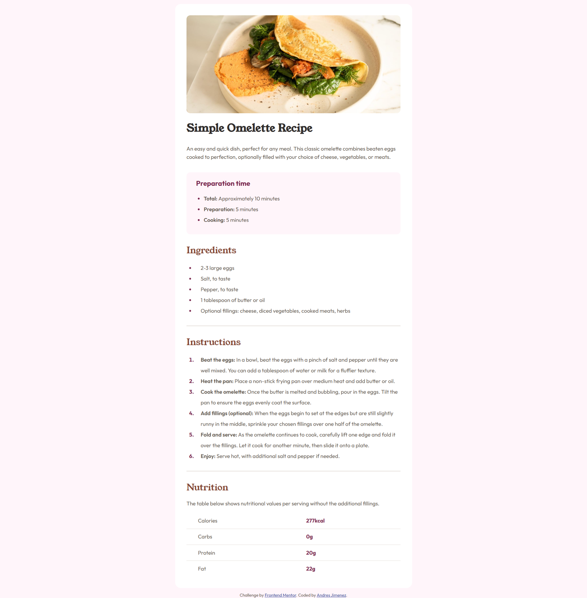

# Frontend Mentor - Recipe page solution

This is a solution to the [Recipe page challenge on Frontend Mentor](https://www.frontendmentor.io/challenges/recipe-page-KiTsR8QQKm). Frontend Mentor challenges help you improve your coding skills by building realistic projects. 

## Table of contents

- [Overview](#overview)
  - [The challenge](#the-challenge)
  - [Screenshot](#screenshot)
  - [Links](#links)
- [My process](#my-process)
  - [Built with](#built-with)
  - [What I learned](#what-i-learned)
  - [Continued development](#continued-development)
- [Author](#author)

## Overview

### Screenshot

### Links

- Solution URL: [https://github.com/andresj24/recipe-page-main](https://github.com/andresj24/recipe-page-main)
- Live Site URL: [https://quiet-pasca-1b5ecf.netlify.app/](https://quiet-pasca-1b5ecf.netlify.app/)

## My process

### Built with

- Semantic HTML5 markup
- CSS custom properties
- Flexbox

### What I learned

This challenge allowed me to review the basic concepts of HTML and CSS, such as positioning, tags, styles, among others.

### Continued development

I will continue with challenges similar to this one to continue strengthening the basics of HTML and CSS.

## Author

- Frontend Mentor - [@andresj24](https://www.frontendmentor.io/profile/andresj24)
- Twitter - [@AndresitoJ96](https://www.twitter.com/andresitoj96)
